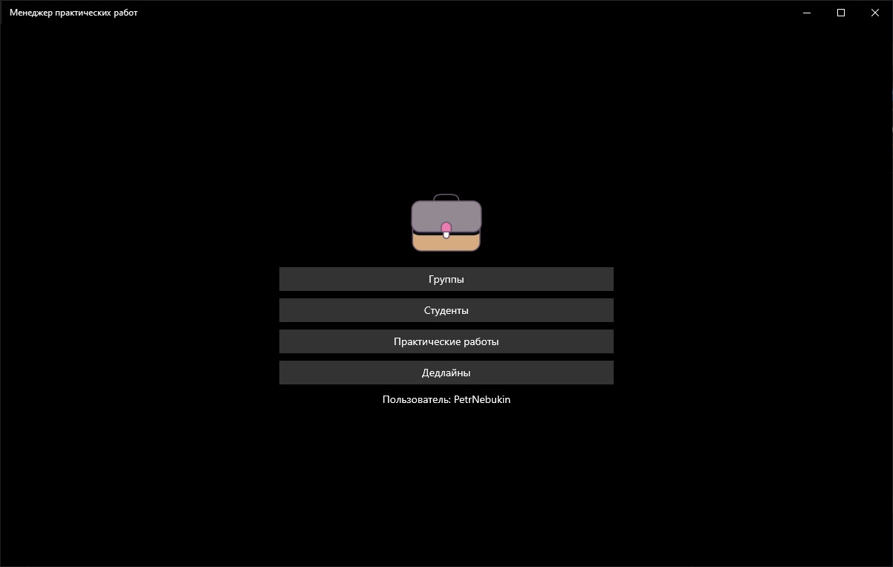
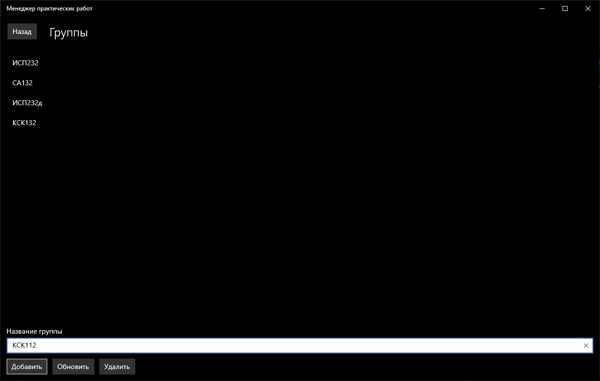
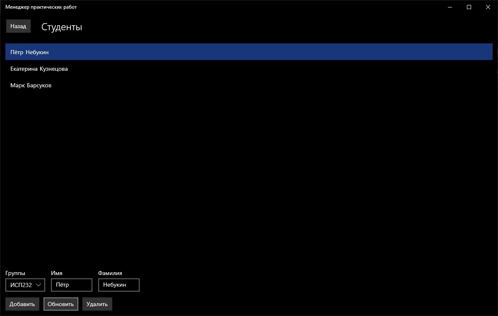
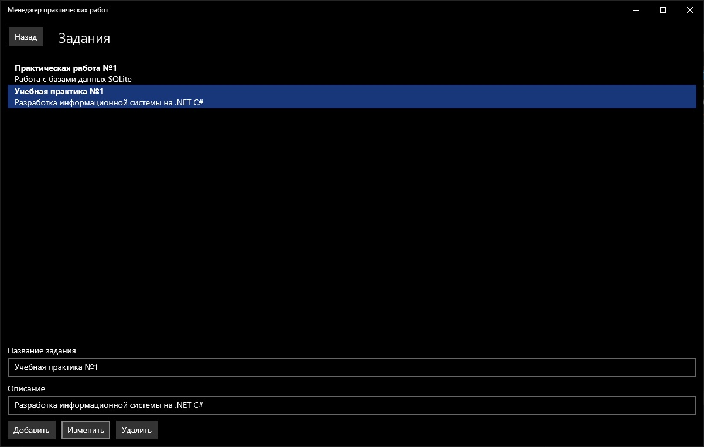
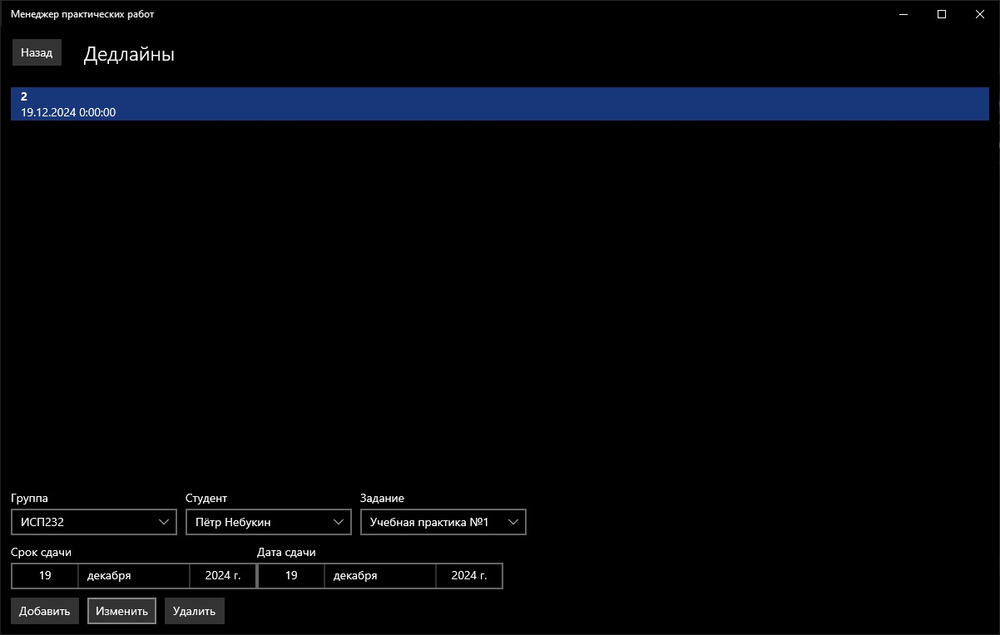

# Менеджер практических работ (PracticalWorksManager, PWM)

## 1. Введение
PracticalWorksManager — это приложение для учета сданных практических работ в учебных группах. Оно разработано для преподавателей и призвано упростить отслеживание выполнения заданий студентами.

Основные возможности приложения:
- Управление учебными группами: добавление, редактирование и удаление групп.
- Управление студентами: добавление, редактирование, удаление и привязка студентов к группам.
- Управление практическими работами: создание заданий с названиями и описаниями, их редактирование и удаление.
- Управление сроками сдачи: назначение сроков выполнения работ для студентов и фиксация дат сдачи.

## 2. Установка и запуск
### 2.1 Требования к системе
Для работы приложения вам потребуется:

- Операционная система: Windows 10 (версия 1803 или более поздняя).
- Дисковое пространство: Не менее 100 МБ свободного места.
- Интернет: Необходим для загрузки приложения из Microsoft Store.

### 2.2 Установка приложения
Чтобы установить "PracticalWorksManager":
1. Перейдите в раздел [Releases](https://github.com/PetrNebukin/KAIT-PWM/releases) данного проекта и загрузите APPX-пакет
2. Нажмите сочетание клавиш Win+R и введите `powershell`
3. В открывшемся окне пройдите в директорию, в которую был ранее загружен APPX-пакет
4. Введите: `Add-AppxPackage <названиефайла.appxbundle>`

### 2.3 Запуск приложения
После установки:
1. Перейдите в меню Пуск - раздел Приложения.
2. Найдите в списке "Менеджер практических работ".

## 3. Главное меню
После запуска вы увидите главное меню приложения. Оно содержит следующие кнопки:

- Группы: Переход к управлению учебными группами.
- Студенты: Переход к управлению списком студентов.
- Задания: Переход к управлению практическими работами.
- Сроки сдачи: Переход к управлению сроками выполнения заданий.

## 4. Управление группами
### 4.1 Просмотр списка групп
На странице "Группы" отображается список всех созданных групп. Для каждой группы указано её название, например, "ИСП232".

### 4.2 Добавление новой группы
Чтобы создать новую группу:
1. Перейдите на страницу "Группы".
2. В текстовое поле "Название группы" введите название, например, "ИСП233".
3. Нажмите кнопку Добавить.
Новая группа появится в списке.

### 4.3 Редактирование группы
Для изменения названия группы:
1. В списке групп щелкните на нужную группу.
2. В текстовом поле "Название группы" появится текущее название.
3. Измените его, например, на "ИСП212".
4. Нажмите кнопку Изменить.
Обновленное название сохранится.

### 4.4 Удаление группы
Чтобы удалить группу:
1. Выберите группу в списке, щелкнув по ней.
2. Нажмите кнопку Удалить.

Группа исчезнет из списка.

> [!CAUTION]
> Удаление группы также удаляет всех студентов этой группы и их сроки сдачи.

## 5. Управление студентами
Этот раздел поможет вам управлять списком студентов.

### 5.1 Просмотр списка студентов
На странице "Студенты" вы увидите список студентов. Чтобы отфильтровать студентов по группе:
1. В выпадающем списке "Группы" выберите нужную группу.
2. В списке отобразятся имена и фамилии студентов этой группы.

## 5.2 Добавление нового студента
Чтобы добавить студента:
1. На странице "Студенты" выберите группу в выпадающем списке "Группы".
2. В поле "Имя" введите имя, например, "Иван".
3. В поле "Фамилия" введите фамилию, например, "Иванов".
4. Нажмите кнопку Добавить.
Студент появится в списке.

### 5.3 Редактирование студента
Для изменения данных студента:
1. Щелкните по студенту в списке.
2. При необходимости измените группу в выпадающем списке "Группы".
3. Обновите имя и фамилию в соответствующих полях.
4. Нажмите кнопку Обновить.
Изменения сохранятся.

### 5.4 Удаление студента
Чтобы удалить студента:
1. Выберите студента в списке, щелкнув по нему.
2. Нажмите кнопку Удалить.
3. Подтвердите удаление, нажав Да в диалоговом окне.
4. Студент исчезнет из списка.
> [!CAUTION]
> Удаление студента также удаляет все его сроки сдачи.

## 6. Управление заданиями
Этот раздел посвящен работе с практическими заданиями.

### 6.1 Просмотр списка заданий
На странице "Задания" отображается список всех работ. Для каждого задания указано название и описание.

### 6.2 Добавление нового задания
Чтобы создать задание:
1. В поле "Название задания" введите название, например, "Лабораторная работа №1".
2. В поле "Описание" добавьте описание, например, "Создание базы данных".
3. Нажмите кнопку Добавить.
Задание появится в списке.

### 6.3 Редактирование задания
Для изменения задания:
1.Щелкните по заданию в списке.
2. Обновите название и описание в соответствующих полях.
3. Нажмите кнопку Обновить.
Изменения сохранятся.

### 6.4 Удаление задания
Чтобы удалить задание:
1. Выберите задание в списке, щелкнув по нему.
2. Нажмите кнопку Удалить.
3. Подтвердите действие, нажав Да.
Задание исчезнет из списка.

> [!CAUTION]
> Удаление задания также удаляет все связанные с ним сроки сдачи.

## 7. Управление сроками сдачи
Этот раздел поможет вам назначать и отслеживать сроки сдачи работ.

### 7.1 Просмотр списка сроков сдачи
На странице "Дедлайны" отображается список всех назначенных сроков. Для каждой записи указаны:
1. Имя и фамилия студента.
2. Название задания.
3. Срок сдачи.
4. Дата сдачи (если работа сдана).

## 7.2 Добавление нового срока сдачи
Чтобы назначить срок:
1. Выберите группу в выпадающем списке "Группа".
2. Выберите студента в выпадающем списке "Студент".
3. Выберите задание в выпадающем списке "Задание".
4. В элементе "Срок сдачи" укажите дату, например, "15.11.2023".
5. Если работа уже сдана, выберите дату сдачи, например, "10.11.2023".
6. Нажмите кнопку Добавить.
Примечание: Если работа еще не сдана, оставьте "Дата сдачи" пустой.

### 7.3 Редактирование срока сдачи
Для изменения срока:
1. Щелкните по записи в списке.
2. При необходимости обновите студента, задание, срок сдачи или дату сдачи.
3. Нажмите кнопку Изменить.
Изменения сохранятся.

### 7.4 Удаление срока сдачи
Чтобы удалить срок:
1. Выберите запись в списке, щелкнув по ней.
2. Нажмите кнопку Удалить.
3. Подтвердите действие, нажав Да.
Запись исчезнет из списка.

## 8. Часто задаваемые вопросы (FAQ)
1. Как добавить студента в группу?
   - Перейдите на страницу "Студенты", выберите группу, введите имя и фамилию, затем нажмите "Добавить".
2. Можно ли перенести студента в другую группу?
   - Да, выберите студента, измените группу в выпадающем списке и нажмите "Обновить".
3. Как проверить, кто не сдал работу?
   - На странице "Сроки сдачи" найдите записи, где поле "Дата сдачи" пустое.
4. Что делать, если я случайно удалил задание?
   - Удаление задания нельзя отменить. Создайте задание заново и назначьте сроки сдачи.
5. Можно ли использовать приложение на нескольких компьютерах?
   - Да, установите приложение на другие устройства с Windows 10.

## 9. Устранение неполадок
1. Приложение не запускается/не устанавливается.  
   - Проверьте, что у вас установлена Windows 10 версии 1803 или новее.  
   - Удалите приложение из Меню Пуск и установите заново из инструкции.
2. Не добавляется новая группа.  
   - Убедитесь, что поле "Название группы" заполнено.  
   - Перезапустите приложение и попробуйте снова.
3. Сроки сдачи не отображаются.  
   - Проверьте, выбрана ли группа в выпадающем списке.  
   - Если проблема сохраняется, переустановите приложение.
